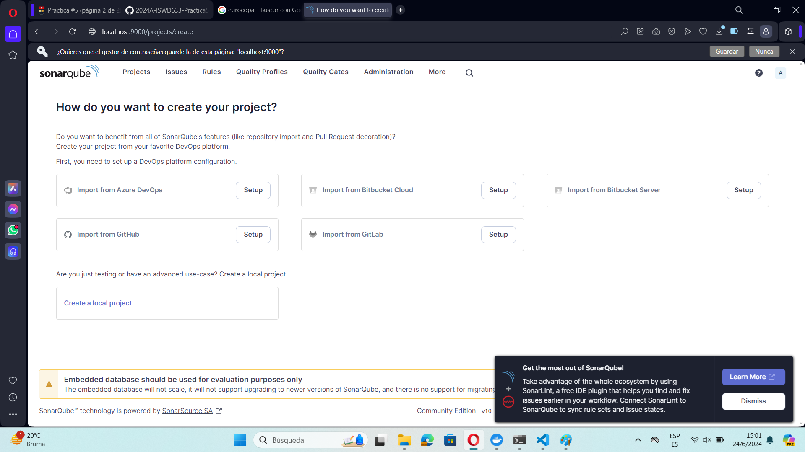

# Ejercicio
Configurar SonarQube utilizando Docker Compose, para esto necesitas dos servicios:
- Servicio: SonarQube
- Desde el host es necesario acceder a SonarQube por lo que necesitas mapear el puerto correspondiente.
- Servicio: PostgreSQL (existen otras opciones: Microsoft SQL Server, Oracle)
- Coloca un healtcheck para cada uno de los servicios.
- Los dos servicios deben pertenecer a uan red de tipo bridge
- Investiga cuáles son los volúmenes necesarios para cada servicio
- Investiga cuáles son las variables de entorno para que los servicios funcionen de manera adecuada.
  
# Una vez creado tu archivo .yaml realiza la respectiva prueba 

El archivo realizado se encuentra en este mismo apartado con el nombre de compose_Juan_Jima.yaml

# COMPLETAR CON UNA CAPTURA DE PANTALLA LUEGO DE EJECUTAR EL ARCHIVO

Una vez de haber realizado el respectivo archivo yaml se ejecuta los siguientes comandos.

### COMANDO 1

El cual se utiliza para iniciar los servicios definidos en un archivo docker-compose.yml en segundo plano.
```bash
docker-compose up -d
```

### COMANDO 2

El cual muestra una lista de contenedores activos junto con detalles como el ID del contenedor, el nombre, la imagen utilizada, el estado, los puertos expuestos y otros detalles relevantes.
```bash
docker ps
```

### EVIDENCIA


# ACCEDER A LOCALHOST:puertoDefinido para ingresar a SonarQube

Una vez ejecutado los comandos anteriores, nos dirigimos al navegador de preferencia y accedemos al localhost. 
Para mi ejemplo es localhost:9000




Teniendo en cuenta que las credenciales en un inicio son admin tanto para correo y contraseña.
Luego se las puede cambiar.
